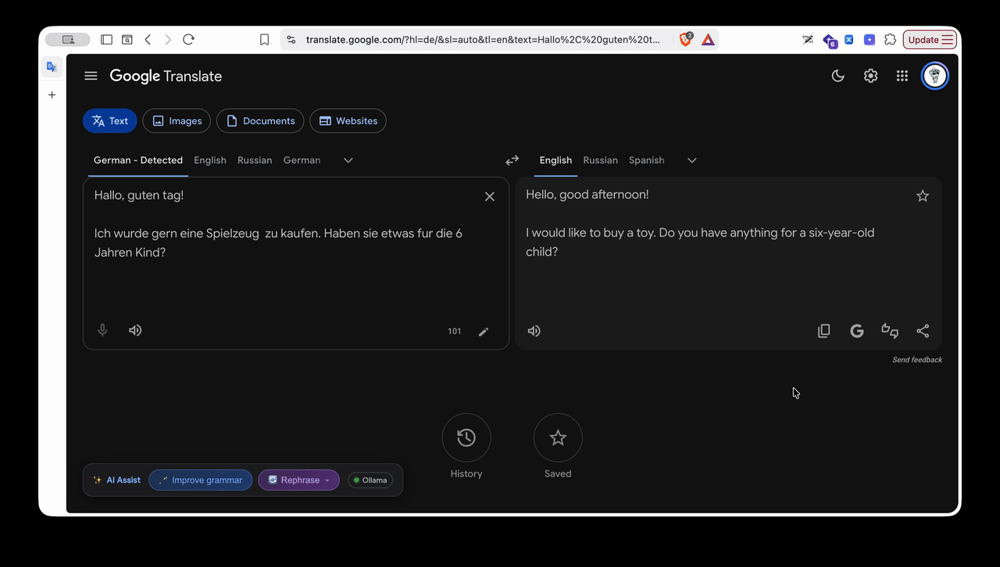

# AI Grammar & Rephrase for Google Translate

A Chrome Extension (Manifest V3) that integrates AI-powered grammar correction and smart rephrasing directly into Google Translate.

Supports **Google Gemini**, **OpenAI**, **DeepSeek**, and local **Ollama** models.

## Features

- **Direct Integration**: Embeds an AI toolbar directly into `translate.google.com`.
- **Grammar Correction**: Fixes grammar, spelling, punctuation, and syntax while preserving meaning.
- **Rephrasing**: Rewrites text across multiple tones (Natural, Professional, Casual, Concise, Academic).
- **Undo & Diff Viewer**: Preview changes side-by-side or revert instantly.
- **Multi-Provider & Custom Models**: Gemini, OpenAI, DeepSeek, and local Ollama with custom model support.
- **Privacy-Focused**: API keys and settings are stored locally in your browser.

## Installation

1. Clone or download this repository.
2. Open Chrome and navigate to `chrome://extensions/`.
3. Enable **Developer mode** (top-right).
4. Click **Load unpacked** and select this directory.

## Setup & Usage

1. Open the extension popup from the Chrome toolbar to select your AI provider, enter your API key (or Ollama URL), and choose a model.
2. Go to [Google Translate](https://translate.google.com) and enter your text.
3. Use the embedded toolbar to improve grammar or rephrase your text.



---
## 📁 Project Structure
```
googletranslate+grammar/
├── manifest.json              # Manifest V3 configuration
├── background/
│   └── service-worker.js      # Background worker handling Gemini, OpenAI, & DeepSeek API requests
├── content/
│   ├── content.js             # Content script injecting toolbar & handling Google Translate DOM
│   └── content.css            # Styles for toolbar, tone dropdown, diff modal, and toasts
├── popup/
│   ├── popup.html             # Extension settings popup UI
│   ├── popup.js               # Settings controller & API key validator
│   └── popup.css              # Modern popup styling
├── img/
│   ├── icon-16.png
│   ├── icon-48.png
│   └── icon-128.png
└── README.md
```
